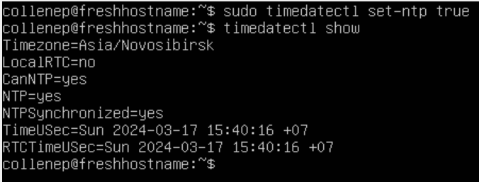

## Part 1. Установка ОС

Выводим информацию о системе с помощью команды `cat /etc/issue`: \

## Part 2. Создание пользователя

Создаём нового пользователя командой `sudo useradd -G adm -s /bin/bash new_user`. Устанавливаем пароль новому пользователю командой `sudo passwd new_user`.

Выводим информацию о пользователях системы командой `cat /etc/passwd`: \

## Part 3. Настройка сети ОС

Для изменения названия машины используем команду `sudo hostnamectl set-hostname user-1`

Для установки временной зоны используем команду `sudo timedatectl set-timezone Asia/Novosibirsk`. Проверяем временные параметры командой `date`.

Выводим сетевые интерфейсы в консоль командой `ip -br link show`: \

**lo** - внутренний виртуальный сетевой интерфейс, позволяющий подключаться машине к самой себе.

Выводим IP адреса, полученные от DHCP сервера, командой `sudo dhclient -v enp0s3`: \

**DHCP** - Dynamic Host Configuration Protocol (Протокол Динамической Настройки Узла).

Выводим внутренний IP-адрес шлюза (GW) командой `hostname -I`: \

Выводим внешний IP-адрес шлюза (IP) командой `curl ifconfig.me`: \

Для изменения IP, GW и DNS редактируем файл `/etc/netplan/00-installer-config.yaml`: \

Совершаем перезапуск системы командой `reboot`.

Выводим внутренний IP-адрес шлюза командой `hostname -I`: \

Проверяем установленный DNS командой `ping`: \
 \

## Part 4. Обновление ОС

С помощью команды `sudo apt update` даём системе понять, какие пакеты нуждаются в обновлении.

Обновляем пакеты с помощью команды `sudo apt upgrade`.

Для того, чтобы убедиться, что пакеты обновились, повторно вводим команду `sudo apt upgrade`: \

## Part 5. Использование команды sudo

С помощью команды `sudo usermod -aG sudo new_user` выдаем пользователю разрешение на выполнение команд от имени суперпользователя.

`sudo` - команда, используемая для получения прав доступа, нужных для взаимодействия с важными системными приложениями.

Переключаемся на пользователя "new_user" командой `su - new_user`.

С помощью команды `sudo hostnamectl set-hostname fresh_hostname` устанавливаем новое имя хоста и выводим информацию о нем с помощью команды `hostnamectl`: \

## Part 6. Установка и настройка службы времени

С помощью команды `sudo timedatectl set-ntp true` включаем синхронизацию по протоколу NTP и проверяем командой `timedatectl show`: \

## Part 7. Установка и использование текстовых редакторов

#### Создание и сохранение файла

**NANO**: \
Для входа в редактор используем команду `nano`. В редакторе пишем nickname: \

Выходим с помощью сочетания клавиш "Ctrl" + "X". Сохраняем изменения с помощью "Y", вписываем название файла и нажимаем "Enter".

**VIM**: \
Для входа в редактор используем команду `vim` В редакторе пишем nickname: \

Нажимаем "Esc" для перехода в командную строку и пишем ":wq test_VIM.txt".

**MCEDIT**: \
Для входа в редактор используем команду `mcedit`. В редакторе пишем nickname: \

Для сохранения нажимаем "F2", вводим название файла и выбираем "Ok". После нажимаем "F10" для выхода из редактора.

#### Редактирование файла (без сохранения)

**NANO**: \
Для редактирования файла используем команду `nano test_NANO.txt`. Далее меняем nickname на строку: \

Для выхода без сохранения файла нажимаем "Ctrl" + "X", после чего нажимаем "N". 

**VIM**: \
Для редактирования файла используем команду `vim test_VIM.txt`. Далее меняем nickname на строку: \

Нажимаем "Esc" для перехода в командную строку и пишем ":q!".

**MCEDIT**: \
Для редактирования файла используем команду `mcedit test_MCEDIT.txt`. Далее меняем nickname на строку: \

Для выхода без сохранения нажимаем "F10" и выбираем "No".

#### Поиск и замена (без сохранения)

**NANO**: \
Для редактирования файла используем команду `nano test_NANO.txt`. Нажимаем "Ctrl" + "W" для поиска строки. Вводим интересующую строку и нажимаем "Enter": \

Нажимаем "Ctrl" + "\\" для замены строки. Вводим заменяемую строку, новую строку и нажимаем "Y":  \

Для выхода без сохранения файла нажимаем "Ctrl" + "X", далее нажимаем "N". 

**VIM**: \
Для редактирования файла используем команду `vim test_VIM.txt`. Нажимаем "Esc" для перехода в командную строку и пишем "/", после чего вводим строку для поиска и нажимаем "Enter": \

Нажимаем "Esc" для перехода в командную строку и пишем ":s/", вводим заменяемую строку, далее "/" и вводим строку для вставки и нажимаем "Enter": \

Нажимаем "Esc" для перехода в командную строку и пишем ":q!".

**MCEDIT**: \
Для редактирования файла используем команду `mcedit test_MCEDIT.txt`. Далее нажимаем "F7", после чего вводим интересующую строку и нажимаем "Enter": \

Далее нажимаем "F4", после чего вводим строку для замены и нажимаем "Enter": \

Для выхода без сохранения нажимаем "F10" и "No".

## Part 8. Установка и базовая настройка сервиса SSHD

Устанавливаем службу SSHd командой `sudo apt install openssh-server`.

Добавляем автостарт службы при загрузке системы командой 'sudo upate-rc.d ssh defaults'.

Для изменения порта редактируем файл `/etc/ssh/sshd_config`. Раскомменчиваем cтроку с портом и меняем адрес: \

Cохраняем изменения в файле и перезапускаем протокол командой `systemctl restart sshd`.

С помощью команды `ps -FC sshd` показываем наличие процесса SSHd: \

- `ps` - команда, использующаяся для отображения информации о работающих процессах на компьютере;
- `-F` - выдача подробной информации;
- `-C` - информация по дочерним процессам.

Перезагружаем систему командой `reboot`.

Для вывода списка сетевых соединений с прочей информацией используем команду `netstat -tan`: \

- `-t` (TCP): отображение всех TCP соединений;
- `-a` (all): вывод всех активных и неактивных соединений, слушающих портов;
- `-n` (numeric): отображение адресов и портов в числовом формате, вместо того чтобы пытаться определять имена доменов и названия служб для соответствующих портов.

В выводе под `0.0.0.0` подразумевается любой адрес.

**Значения столбцов вывода**:
1. Proto - протокол сетевого соединения
2. Recv-Q - размер очереди получения в байтах
3. Send-Q - размер очереди отправки в байтах
4. Local Address - локальный адрес соединения
5. Foreign Address - адрес удаленной стороны соединения
6. State - текущее состояние соединения

## Part 9. Установка и использование утилит top, htop

Для вывода мониторинга процессов используем команду `top`: \

- uptime - `39 min`;
- количество авторизованных пользователей - `1 user`; 
- общая загрузка системы - `load average: 0.02, 0.02, 0.00`;
- общее количество процессов - `105 total`;
- загрузка cpu - `0.0 us, 0.0 sy, 0.0 ni, 99.8 id, 0.2 wa, 0.0 hi, 0.0 si, 0.0 st`;
- загрузка памяти - `1971.4 total, 1504.2 free, 148.0 used, 319.2 buff/cache`;
- pid процесса занимающий больше всего памяти - `1 root`;
- pid процесса, занимающий больше всего процессорного времени - `1 root`.

Для вывода мониторинга процессов используем продвинутый интерактивный инструмент `htop`.

Сортировка по PID: \

Сортировка по PERCENT_CPU: \

Сортировка по PERCENT_MEM: \

Сортировка по TIME: \

Отфильтрованный для процесса sshd: \

Процесс syslog, найденный при помощи поиска: \

Вывод hostname, clock и uptime: \

## Part 10. Использование утилиты fdisk

Для вывода информации о жестком диске воспользуемся командой `fdisk -l`: \

- Название жесткого диска: `VBOX HARDDISK`;
- Размер: `10 GiB, 10737418240`;
- Количество секторов: `20971520`;
- Размер swap: 0.

## Part 11. Использование утилиты df

Выводим информацию о дисковом пространстве командой `df`: \

**Информация о корневом разделе**:
- Размер раздела - `8408452`;
- Размер занятого пространства - `4761104`;
- Размер свободного пространства - `3198632`;
- Процент использования - `60%`;
- Единица измерения: КБ (килобайт).

Выводим информацию о дисковом пространстве с типом файловой системы и удобочитаемым выводом помяти командой `df -Th`: \

**Информация о корневом разделе**:
- Размер раздела - `8.1G`;
- Размер занятого пространства - `4.6G`;
- Размер свободного пространства - `3.1G`;
- Процент использования - `60%`;
- Тип файловой системы раздела - `ext4`.

## Part 12. Использование утилиты du

Выводим информацию о дисковом пространстве командой `du`: \

По умолчанию команда выводит размер в килобайтах.

Выводим размер папок `/home`, `/var` и `/var/log` в байтах командой `sudo du -sb /home /var/log /var`: \

Выводим размер папок `/home`, `/var` и `/var/log` в человекочитаемом виде командой `sudo du -sh /home /var/log /var`: \

**Флаги**:
- `-s` - вывод нужных директорий;
- `-h` - вывод в человекочитаемом стиле;
- `-b` - вывод в нужном размере.

Выводим содержимое каждого вложенного элемента в `/var/log` командой `sudo du -s /var/log/*`: \

## Part 13. Установка и использование утилиты ncdu

Устанавливаем ncdu командой `sudo apt install ncdu`. Провеяем работоспособность запуском утилиты командой `ncdu`: \

Выводим размер папки `/home` командой `ncdu /home`: \

Выводим размер папки `/var` командой `ncdu /var`: \

Выводим размер папки `/var/home` командой `ncdu /var/home`: \

## Part 14. Работа с системными журналами

Для удобного просмотра логов открываем файлы в редакторе `vim` с флагом `-R` (только чтение).

**Файлы с логами**: `/var/log/dmesg`, `/var/log/syslog`, `/var/log/auth.log`.

Просматриваем файл логов, связаннный с аунтефикацией, командой `nano -R /var/log/auth.log` и находим последнюю авторизацию пользователя: \

- Время последней авторизации: `20:34:42`;
- Имя авторизовавшегося пользователя: `collenep`;
- Метод входа в систему `TTY=tty1`.

Перезапускаем SSHD командой `sudo systemctl restart sshd`, открываем `/var/log/auth.log` и ищем логи перезагрузки утилиты: \

## Part 15. Использование планировщика заданий CRON

Cron — это планировщик задач, используемый для выполнения задач (в фоновом режиме) в указанное время.

Открываем планировщика задач для редактирования командой `crontab -e` и ставим запуск команды `uptime` каждые 2 минуты: \

Проверяем файл `/var/log/syslog` на работу CRON: \

Выводим содержимое файла командой `crontab -l`: \

Открываем планировщика задач для редактирования командой `crontab -e` удаляем задание. После выводим содержимое планировщика командой `crontab -l`: \

